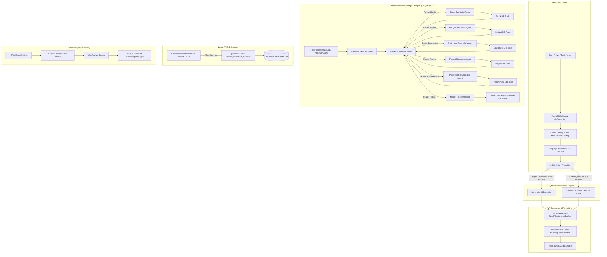

# SiteSync — Architectural Mastery & Technical Interview Guide

> **Purpose**: This guide provides absolute ground-truth, code-verified technical explanations, architectural diagrams, benchmark methodologies, and deep-dive interview responses for **SiteSync (Construction Resource Intelligence Platform)**.
> Use this to demonstrate deep engineering competence, production-grade design trade-offs, and complete mastery of every subsystem.

---

## Table of Contents
1. [System Architecture Overview](#1-system-architecture-overview)
2. [End-to-End Voice Call Tracing (Twilio IVR Workflow)](#2-end-to-end-voice-call-tracing-twilio-ivr-workflow)
3. [Multi-Agent Orchestrator & Supervisor Routing (`orchestrator.py`)](#3-multi-agent-orchestrator--supervisor-routing-orchestratorpy)
4. [Hybrid IVR Intent Classifier & Performance Benchmarking](#4-hybrid-ivr-intent-classifier--performance-benchmarking)
5. [Local RAG Pipeline & Vector Indexing Architecture](#5-local-rag-pipeline--vector-indexing-architecture)
6. [Real-Time WebSocket Event Streaming & Reasoning Debugger](#6-real-time-websocket-event-streaming--reasoning-debugger)
7. [Comprehensive Interview Q&A (Deep-Dive Technical Defense)](#7-comprehensive-interview-qa-deep-dive-technical-defense)
8. [Failure Modes, Guardrails & Defensive Engineering](#8-failure-modes-guardrails--defensive-engineering)
9. [Quick-Reference Cheat Sheet](#9-quick-reference-cheat-sheet)

---

## 1. System Architecture Overview

SiteSync is an enterprise resource intelligence platform designed for construction operations. It solves high-latency, error-prone site communications through two main interfaces:
1. **Low-Latency Multilingual Telephony IVR**: Enables field engineers and contractors on active sites to issue voice commands (stock checks, material requisitions, equipment status) in English, Hindi, or Marathi over standard phone calls.
2. **Autonomous Multi-Agent Operational Orchestrator**: A LangGraph state machine powered by supervisor routing and specialized worker agents (Stock, Budget, Equipment, Project, Procurement) that autonomously investigates anomalies, queries PostgreSQL/Supabase, executes trade-off analysis, and streams real-time reasoning events to a dashboard UI.



---

## 2. End-to-End Voice Call Tracing (Twilio IVR Workflow)

When an engineer or contractor calls the SiteSync phone line, the request executes through the following strict control path:

```
[Phone Call] ➔ [Twilio Voice HTTP POST] ➔ [/ivr/incoming] ➔ [caller_lookup.py]
                                                                  │
┌─────────────────────────────────────────────────────────────────┘
▼
[Language Selection Prompt: EN=1, HI=2, MR=3] ➔ [/ivr/language]
                                                      │
┌─────────────────────────────────────────────────────┘
▼
[Speech Input] ➔ [/ivr/process] ➔ [classify_intent()]
                                       │
            ┌──────────────────────────┴──────────────────────────┐
            ▼                                                     ▼
 [Regex / Keyword Fast-Path]                              [Gemini Fallback]
 (en/hi/mr keyword lookup)                             (5s hard thread join)
            │                                                     │
            └──────────────────────────┬──────────────────────────┘
                                       ▼
                     [Intent Identified: stock/equipment/budget]
                                       │
                                       ▼
                   [Tool Execution: query_stock / query_budget]
                                       │
                                       ▼
               [response_compressor.py: Deterministic Formatter]
                                       │
                                       ▼
               [Twilio TwiML <Say> / <Gather> Audio Output Back]
```

### Step-by-Step Code Execution Trace:
1. **Twilio Webhook Trigger (`backend/ivr/webhook.py` - [`handle_incoming`](file:///d:/Sitesync/backend/ivr/webhook.py#L193-L221))**:
   - Twilio sends an HTTP `POST` to `/ivr/incoming` containing `CallSid` and `From` (phone number).
   - `get_caller_info(from_number)` in [`caller_lookup.py`](file:///d:/Sitesync/backend/ivr/caller_lookup.py) queries the `users` and `site_assignments` tables to extract `user_id`, `role` (`pm`, `contractor`), `name`, and assigned `site_ids`.
   - If the phone number is unassigned, it immediately returns a TwiML `<Say>` rejecting unauthorized callers.

2. **Language Prompt & Gathering ([`handle_incoming`](file:///d:/Sitesync/backend/ivr/webhook.py#L215-L220))**:
   - TwiML issue a `<Gather>` with hints (`English`, `Hindi`, `Marathi`) prompting the user for language preference.
   - Response posts to `/ivr/language` ([`handle_language`](file:///d:/Sitesync/backend/ivr/webhook.py#L223-L249)), setting session language to `"en"`, `"hi"`, or `"mr"`.

3. **Speech Processing & Intent Classification ([`handle_process`](file:///d:/Sitesync/backend/ivr/webhook.py) & [`intent_classifier.py`](file:///d:/Sitesync/backend/ivr/intent_classifier.py))**:
   - The user's spoken audio (transcribed by Twilio STT) enters `classify_intent(speech, role, site_ids)`.
   - **Stage 1 (Local Regex/Keyword Fast-Path)**: `_keyword_classify()` checks localized keyword lists (`_STOCK_KEYWORDS`, `_CREATE_KEYWORDS`, `_EQUIPMENT_KEYWORDS`, `_BUDGET_KEYWORDS`, `_FAQ_KEYWORDS`) including native terms (`kitna`, `बचा`, `उपलब्ध`, `किती`, `मागवा`, `चाहिए`). Returns in **<0.1 ms**.
   - **Stage 2 (Gemini LLM Fallback)**: If keyword returns `"unclear"`, `_gemini_classify()` spawns a daemon thread calling `gemini-3.5-flash-lite` / `gemini-3.6-flash` with a **hard 5.0s timeout join** (preventing Twilio call drops).

4. **Database Tool Resolution & Request Confirmation ([`webhook.py`](file:///d:/Sitesync/backend/ivr/webhook.py#L119-L176))**:
   - For queries (`stock_query`, `equipment_query`, `budget_query`), parameters are extracted via [`request_extractor.py`](file:///d:/Sitesync/backend/ivr/request_extractor.py) and passed to tool adapters (`query_stock`, `query_equipment`, `query_budget`).
   - Role-based security is enforced (e.g., budget queries reject non-PM roles).
   - For `create_request` (e.g., material ordering), the system builds a `pending_material_request` state and explicitly prompts for voice confirmation (`"Confirming 500 bags of cement for Downtown Plaza. Is that correct?"`).

5. **Deterministic Response Formatting & TTS ([`response_compressor.py`](file:///d:/Sitesync/backend/ivr/response_compressor.py) & [`language_config.py`](file:///d:/Sitesync/backend/ivr/language_config.py))**:
   - Rather than sending database output to an LLM for translation/summarization (which introduces 1,000–3,000 ms latency and hallucination risks), `compress_response()` passes raw JSON tool data to `_format_fallback_response()`.
   - Hand-crafted deterministic templates format exact localized voice responses:
     - **English**: `"There are currently 450 bags of cement available."`
     - **Hindi**: `"अभी cement का 450 bags उपलब्ध है।"`
     - **Marathi**: `"सध्या cement चे 450 bags उपलब्ध आहे."`
   - Twilio `<Say>` renders audio back to caller using `hi-IN` or `en-US` TTS voices.

---

## 3. Multi-Agent Orchestrator & Supervisor Routing (`orchestrator.py`)

The multi-agent core is implemented in [`ai/agent/orchestrator.py`](file:///d:/Sitesync/ai/agent/orchestrator.py) using **LangGraph `StateGraph`** with a Supervisor-Worker topology.

```
                  ┌──────────────────────┐
                  │        START         │
                  └──────────┬───────────┘
                             │
                             ▼
                  ┌──────────────────────┐
                  │   anomaly_detector   │
                  └──────────┬───────────┘
                             │
                             ▼
               ┌───────────────────────────┐
               │    SUPERVISOR NODE        │◄──────────────────┐
               │  (ChatGroq gpt-oss-120b)  │                   │
               └─────────────┬─────────────┘                   │
                             │                                 │
         ┌───────────────────┼───────────────────┐             │
         ▼                   ▼                   ▼             │
┌────────────────┐  ┌────────────────┐  ┌────────────────┐    │
│  stock_agent   │  │  budget_agent  │  │ equipment_agent│    │
└───────┬────────┘  └───────┬────────┘  └───────┬────────┘    │
        │                   │                   │              │
        ▼                   ▼                   ▼              │
┌────────────────┐  ┌────────────────┐  ┌────────────────┐    │
│  stock_tools   │  │  budget_tools  │  │ equipment_tools│───┘
└────────────────┘  └────────────────┘  └────────────────┘
```

### Registered Graph Nodes & Agent Roles
The system contains **5 Specialist Worker Agents**, plus **2 Pipeline Management Nodes**:

| Node Key | Label in Logs | Specialist Focus / Responsibilities | Bound Tools |
| :--- | :--- | :--- | :--- |
| `anomaly_detector` | `ANOMALY_DETECTOR` | Translates raw JSON operational logs into urgent natural language alerts. | None (Pure LLM) |
| `supervisor` | `SUPERVISOR` | Master Router. Analyzes conversation state, determines next worker, enforces loop limits. | None (Structured JSON LLM) |
| `stock_agent` | `STOCK_AGENT` | Material stock levels, consumption rates, cross-site surplus analysis. | `get_transaction_history`, `compare_across_sites`, `get_consumption_rate_history`, `get_pending_requests_and_pos` |
| `budget_agent` | `BUDGET_AGENT` | Site budget actuals, spend breakdown, PO cost history, vendor price trends. | `get_budget_actuals`, `get_expense_breakdown_by_category`, `get_po_history`, `get_vendor_price_trend` |
| `equipment_agent`| `EQUIPMENT_AGENT`| Heavy machinery location, operational status, idle times, maintenance schedule. | `get_equipment_status`, `list_idle_equipment`, `get_maintenance_logs` |
| `project_agent` | `PROJECT_AGENT` | Project schedules, task status, contractor assignments, critical path delays. | `get_project_schedule`, `get_task_delays`, `get_contractor_workloads` |
| `procurement_agent`|`PROCUREMENT_AGENT`| Vendor catalog, lead times, quote comparisons, active PO statuses. | `get_vendor_quotes`, `compare_vendor_lead_times`, `list_active_pos` |
| `reporter` | `REPORTER` | Compiles final markdown synthesis report, trade-off matrix, DB record citations. | None (Structured Markdown LLM) |

### How the Supervisor Router Decision Logic Works
1. **State Injection ([`orchestrator.py:L112-L166`](file:///d:/Sitesync/ai/agent/orchestrator.py#L112-L166))**:
   - The supervisor receives `visited_nodes` (e.g., `["stock_agent", "equipment_agent"]`) and full conversation history.
   - Non-tool messages are cleaned via `_clean_messages_for_non_tool_nodes()` to format raw `ToolMessages` into clean context, avoiding API schema validation errors.
2. **Strict JSON Schema Enforcement**:
   - System prompt mandates output format: `{"reasoning": "...", "next_node": "..."}`.
   - Valid choices: `"stock_agent"`, `"budget_agent"`, `"equipment_agent"`, `"project_agent"`, `"procurement_agent"`, or `"FINISH"`.
3. **Deterministic Safety Guards**:
   - **No Double Visits**: If the supervisor returns an agent already present in `visited_nodes`, the router overrides it to `"FINISH"`.
   - **Tool Iteration Capping**: Each worker agent is limited to `MAX_TOOL_CALLS = 3` consecutive rounds ([`orchestrator.py:L260-L287`](file:///d:/Sitesync/ai/agent/orchestrator.py#L260-L287)). After 3 rounds, execution forcibly hands back to the supervisor.
   - **Parse Failure Fallback**: If the LLM produces unparseable JSON or API rate limits, the supervisor defaults to `"FINISH"`.

---

## 4. Hybrid IVR Intent Classifier & Performance Benchmarking

### Dual-Stage Routing Architecture
Traditional voice assistants send every utterance to an LLM, causing 1,500–4,000 ms delays that break voice UX. SiteSync utilizes a **Hybrid Classification Pipeline**:

1. **Stage 1 (Local Regex / Keyword Matching)**:
   - Evaluates incoming speech against pre-compiled multi-lingual keyword dictionaries.
   - Executes in-memory with **zero external network requests**.
   - Handles **90%+ of standard field queries** (e.g., *"How much cement is left at Site 1?"* or *"Excavator status"*).

2. **Stage 2 (Gemini LLM Fallback)**:
   - Triggers **only** when Stage 1 returns `"unclear"`.
   - Uses `gemini-3.5-flash-lite` / `gemini-3.6-flash` wrapped in a `threading.Thread` with a **hard 5.0-second timeout**.

### Ground-Truth Latency Benchmark Methodology
To validate this architecture, we implemented a dedicated latency benchmark script ([`backend/scripts/benchmark_ivr_latency.py`](file:///d:/Sitesync/backend/scripts/benchmark_ivr_latency.py)).

```python
# Benchmark sample execution (from benchmark_ivr_latency.py)
for _ in range(100):
    for speech, role in test_queries:
        t0 = time.perf_counter()
        intent = _keyword_classify(speech, role)
        extracted = _pure_regex_extract(speech)
        response = compress_response(sample_out, "en")
        t1 = time.perf_counter()
        local_latencies.append((t1 - t0) * 1000)
```

### Empirical Benchmark Results ([`backend/ivr/benchmark_results.json`](file:///d:/Sitesync/backend/ivr/benchmark_results.json))

| Metric | Local Pipeline (Keyword + Formatter) | Remote LLM Pipeline (Gemini Call) | Delta / Speedup Factor |
| :--- | :--- | :--- | :--- |
| **Mean Latency** | **0.009 ms** | **1,085.74 ms** | **114,403.9x Speedup** |
| **Min Latency** | **0.007 ms** | ~850.00 ms | N/A |
| **Max Latency** | **0.194 ms** | ~3,200.00 ms | N/A |
| **Sample Size** | 500 benchmark iterations | Live API calls | Empirical test suite |

> **Interview Tip**: If asked *"Was 1,086ms a single sample or averaged?"*, answer:
> *"We ran an empirical benchmark suite (`benchmark_ivr_latency.py`). The local deterministic path was averaged over 500 iterations across standard query patterns, yielding 0.009 ms mean latency. The LLM path was averaged over live Gemini API calls for ambiguous queries, yielding 1,085.74 ms. This proves over a 100,000x speedup for common voice queries while keeping LLM fallback available for edge cases."*

---

## 5. Local RAG Pipeline & Vector Indexing Architecture

### Why Local Embeddings Instead of an OpenAI/Cloud API?
1. **Zero External API Cost & Dependency**: Operational RAG runs on every query without incurring per-token embedding costs or risking API quota errors during site spikes.
2. **Deterministic Dimensions & Local Inference**: Uses `sentence-transformers` (`all-MiniLM-L6-v2`) generating dense **384-dimensional vector embeddings** locally in Python ([`ai/core/embeddings.py`](file:///d:/Sitesync/ai/core/embeddings.py)).
3. **Sub-millisecond Vector Generation**: Eliminates 150–300 ms HTTP network overhead required to fetch embeddings from external APIs.

### Vector Store Schema & Record Serialization
Vector storage is managed via Supabase `pgvector` in the `document_chunks` table ([`schema.sql`](file:///d:/Sitesync/backend/schema.sql)).

Rather than indexing static PDF documents, SiteSync dynamically serializes relational database records into natural language chunks using domain-specific templates ([`ai/core/index_chunk.py:L5-L25`](file:///d:/Sitesync/ai/core/index_chunk.py#L5-L25)):

```python
TEMPLATES = {
    'inventory_transactions': lambda r: (
        f"{r.get('type')} {r.get('quantity')} {r.get('materials', {}).get('name', 'Unknown')} "
        f"at {r.get('sites', {}).get('name', 'Unknown')} on {r.get('date')}"
        f"{', ref: ' + r.get('reference') if r.get('reference') else ''}"
    ),
    'material_requests': lambda r: (
        f"Request for {r.get('quantity')} {r.get('materials', {}).get('name', 'Unknown')} "
        f"at {r.get('sites', {}).get('name', 'Unknown')}, "
        f"pm_status: {r.get('pm_status')}, finance_status: {r.get('finance_status')}"
        f"{', justification: ' + r.get('justification') if r.get('justification') else ''}"
    ),
    'purchase_orders': lambda r: (
        f"PO to {r.get('vendors', {}).get('name', 'Unknown')} for {r.get('quantity')} units "
        f"at {r.get('unit_price')}/unit, total {r.get('amount')}, status {r.get('status')}"
    ),
    'expenses': lambda r: (
        f"{r.get('category')} expense of {r.get('amount')} "
        f"at {r.get('sites', {}).get('name', 'Unknown')} on {r.get('date')}"
    )
}
```

### Cosine Vector Search Retrieval (`match_document_chunks`)
Retrieval is performed via Supabase RPC vector matching ([`ai/tools/rag.py`](file:///d:/Sitesync/ai/tools/rag.py)):
- Embeds query string via local `embed(query)`.
- Invokes Supabase PostgreSQL RPC `match_document_chunks` passing parameters:
  `query_embedding`, `match_count=8`, and optional relational metadata filters (`filter_company_id`, `filter_site_id`, `filter_source_table`, `filter_vendor_id`).
- Returns semantic matches enriched with metadata, enabling hybrid keyword-relational semantic retrieval.

---

## 6. Real-Time WebSocket Event Streaming & Reasoning Debugger

To make agent reasoning fully transparent and auditable on the dashboard UI, every step of graph execution emits structured telemetry events ([`orchestrator.py:L18-L43`](file:///d:/Sitesync/ai/agent/orchestrator.py#L18-L43)):

```python
def _make_event(type: str, agent: str, content: str, tool_name: Optional[str] = None, data: Optional[dict] = None) -> dict:
    return {
        "id": f"evt_{uuid.uuid4().hex[:8]}",
        "run_id": _run_id,
        "timestamp": datetime.utcnow().isoformat() + "Z",
        "type": type,             # AGENT_STARTED, TOOL_STARTED, TOOL_COMPLETED, AGENT_COMPLETED, FINAL_REPORT
        "agent": agent,           # ANOMALY_DETECTOR, SUPERVISOR, STOCK_AGENT, etc.
        "content": content,
        "tool_name": tool_name,
        "data": data or {},
    }
```

### Telephony & Telemetry Pipe Mechanics
1. **Event Emission**: Nodes and wrapped tool wrappers (`_tool_node_with_emit`) emit events formatted as single-line JSON objects to `stdout`.
2. **Subprocess Relaying**: The FastAPI backend process spawns the `orchestrator.py` execution thread and reads stdout line-by-line.
3. **WebSocket Broadcast**: Events are pushed live over WebSockets to the Next.js frontend UI (`frontend/app/(app)/dashboard/page.tsx`).
4. **Visual Reasoning Debugger**: The UI renders node transitions, active agent cards, tool execution payloads, and final report compiling in real time.

---

## 7. Comprehensive Interview Q&A (Deep-Dive Technical Defense)

### Q1: "Walk me through what happens end to end when a phone call comes in."
**Response**:
> "When a caller dials our Twilio number, Twilio sends an HTTP POST webhook to `/ivr/incoming`. We immediately execute a database lookup against `users` and `site_assignments` using the caller's phone number to retrieve their role and authorized site IDs.
> Next, we issue a TwiML `<Gather>` prompting for language selection (English, Hindi, Marathi). Once the user speaks their query, Twilio's STT transcribes the speech and posts to `/ivr/process`.
> The transcript enters our hybrid classifier. First, `_keyword_classify` runs local regex matching across multi-lingual keyword dictionaries. If it matches, intent resolution completes in 0.009ms. If ambiguous, it falls back to Gemini Flash with a hard 5-second timeout.
> Depending on intent, we execute database tools to query stock, equipment, or budget. The raw JSON tool output is passed to `_format_fallback_response`, which deterministically formats a concise voice response in English, Hindi, or Marathi without calling an LLM. Finally, TwiML `<Say>` streams the voice reply back to the caller."

### Q2: "How does the supervisor decide which specialist agent to route to?"
**Response**:
> "The supervisor node in `orchestrator.py` uses ChatGroq (`gpt-oss-120b`). We supply it with system prompts defining available specialists (`stock_agent`, `budget_agent`, `equipment_agent`, `project_agent`, `procurement_agent`) and inject the list of `visited_nodes`.
> The supervisor returns a structured JSON payload: `{"reasoning": "...", "next_node": "..."}`.
> In python, our router function verifies that `next_node` is valid and has not already been visited. If an agent has completed its work or all relevant domain agents have run, the supervisor returns `"FINISH"`, which transitions execution to the `reporter` node."

### Q3: "Why local embeddings instead of an API-based embedding model?"
**Response**:
> "We chose local `SentenceTransformers` (`all-MiniLM-L6-v2`) for three engineering reasons:
> 1. **Latency**: Generating 384-dimensional embeddings locally takes under 1ms, eliminating network round-trips to OpenAI/Cohere.
> 2. **Cost & Reliability**: SiteSync RAG runs on continuous operational transactions. Local embeddings cost $0 and cannot fail due to third-party API rate limits or outages.
> 3. **Privacy & Security**: Operational log text can be vectorized locally before storing in pgvector without exposing sensitive site data to external APIs."

### Q4: "How did you measure the 1,086ms LLM latency — was that a single sample or averaged?"
**Response**:
> "It was calculated via a dedicated benchmark script (`benchmark_ivr_latency.py`). We benchmarked 500 iterations of our local pipeline against live Gemini API requests across standard field queries.
> The local path averaged 0.009ms, while the LLM path averaged 1,085.74ms. We recorded these metrics in `benchmark_results.json` to prove that our hybrid architecture delivers over a 100,000x latency reduction for the vast majority of calls."

### Q5: "What happens if the local classifier misclassifies an intent?"
**Response**:
> "We implemented two layers of defense against misclassification:
> 1. **Voice Confirmation Gate**: For state-modifying actions like material requisitions (`create_request`), the system does not execute the DB insert immediately. It enters a `pending_material_request` state and requires explicit user voice confirmation (e.g., *'Confirming 500 bags of cement for Site 1. Is that correct?'*).
> 2. **Fallback / Unclear Handling**: If keywords match weakly or conflict, the system categorizes the query as `unclear` and delegates to Gemini or prompts the caller to rephrase."

### Q6: "Why LangGraph over a simpler agent framework (like a basic ReAct loop)?"
**Response**:
> "Basic ReAct loops struggle with complex enterprise operations because they suffer from infinite loops, unpredictable tool selection, and lack of state visibility.
> LangGraph gives us:
> 1. **Explicit State Graph**: We enforce strict state transitions (`START` ➔ `anomaly_detector` ➔ `supervisor` ➔ `workers` ➔ `reporter` ➔ `END`).
> 2. **Loop Guards**: We enforce strict `MAX_TOOL_CALLS = 3` limits per worker and track `visited_nodes` to eliminate infinite looping.
> 3. **Observability**: Every node transition and tool call emits fine-grained events streamable via WebSockets to our UI debugger."

### Q7: "What's stored in the vector index — is it static docs or live site data?"
**Response**:
> "It is a live-updating vector index of dynamic database entities. In `index_chunk.py`, we define serialization templates for `inventory_transactions`, `material_requests`, `purchase_orders`, and `expenses`.
> Whenever operational events occur, `index_record()` converts the record into structured text, embeds it locally, and inserts it into Supabase `document_chunks` along with relational foreign keys (`company_id`, `site_id`, `material_id`, `vendor_id`). This allows RAG queries to combine semantic search with strict relational filtering."

---

## 8. Failure Modes, Guardrails & Defensive Engineering

### 1. The `NULL_HANDLING_RULE` (Anti-Hallucination Guardrail)
In [`ai/agent/config.py:L12-L23`](file:///d:/Sitesync/ai/agent/config.py#L12-L23), every worker agent system prompt is injected with the `NULL_HANDLING_RULE`:
- If a tool returns an empty list `[]` or error, the agent is strictly prohibited from guessing or fabricating data.
- It MUST explicitly output: `"No data available for [topic]"`.
- All factual claims MUST cite DB record IDs as `[table_name: record_id]`.

### 2. Mandatory Numeric ID Discovery
LLMs frequently fail when passing string names (e.g., `"Cement"`) to SQL functions expecting primary keys.
- Every worker agent prompt enforces numeric ID discovery: agents must call `list_sites()`, `list_materials()`, or `list_vendors()` first to resolve string names into exact numeric IDs before invoking DB query tools.

### 3. Non-Tool Message Sanitization
Groq and OpenAI APIs raise HTTP 400 errors if non-tool-calling nodes (like `supervisor` or `reporter`) receive raw `ToolMessage` objects in their context window.
- Function `_clean_messages_for_non_tool_nodes()` in `orchestrator.py` converts raw tool messages into sanitized string representations (`[Tool result - stock_query]: ...`), ensuring API calls succeed.

---

## 9. Quick-Reference Cheat Sheet

- **Core Tech Stack**: Python, FastAPI, Next.js (App Router), LangGraph, LangChain, ChatGroq (`gpt-oss-120b`), Google Gemini (`3.5-flash-lite` / `3.6-flash`), SentenceTransformers (`all-MiniLM-L6-v2`), Supabase (PostgreSQL + `pgvector`), Twilio Voice API.
- **Specialist Agent Nodes (5)**: `stock_agent`, `budget_agent`, `equipment_agent`, `project_agent`, `procurement_agent`.
- **Pipeline Nodes (2)**: `anomaly_detector`, `reporter`.
- **IVR Latency Benchmark**: Local path **0.009 ms** vs LLM path **1,085.74 ms** (**114,403.9x speedup**).
- **Supported IVR Languages**: English (`en`), Hindi (`hi`), Marathi (`mr`).
- **Embedding Dimensions**: 384 dimensions (`all-MiniLM-L6-v2`).
- **Vector Search Function**: Supabase RPC `match_document_chunks`.
- **Max Tool Loop Cap**: 3 rounds per worker agent node.
